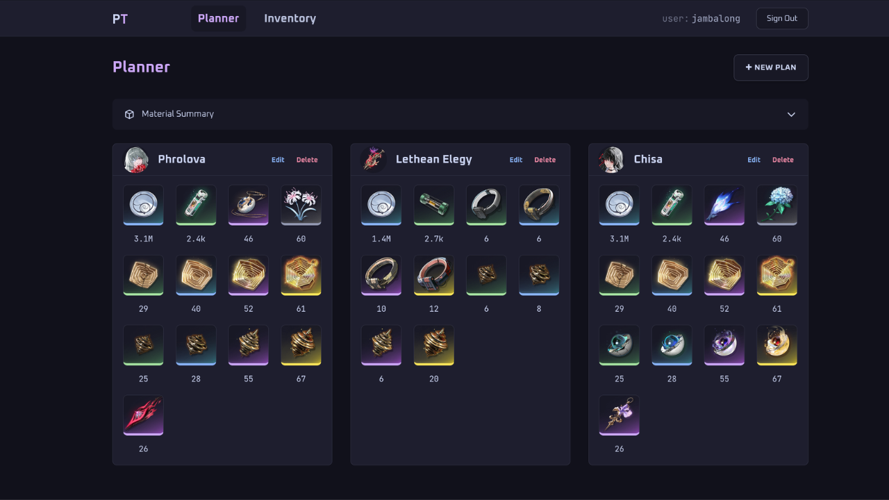
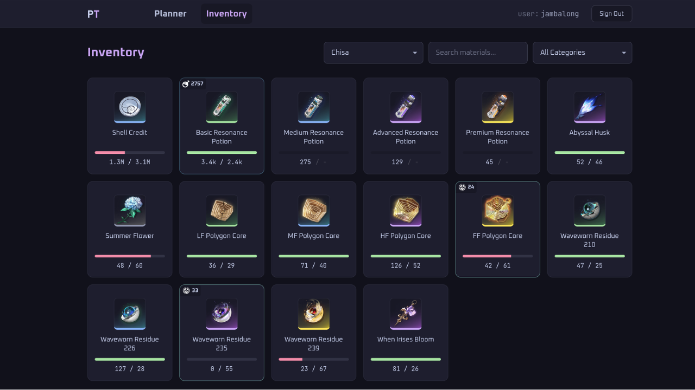
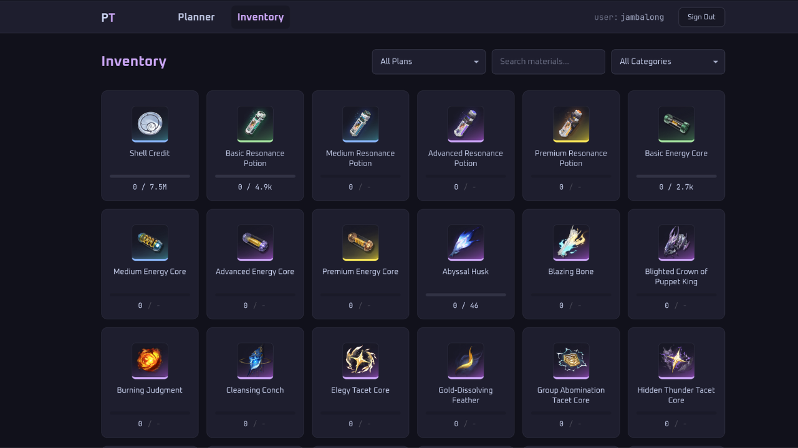

# Wuthering Waves Resource Optimization Platform

**Pangu Terminal** helps *Wuthering Waves* players plan and track the materials needed to max out their Resonators and weapons. Input your current levels and target upgrades, track what you own, and the app automatically shows you what to farm next accounting for synthesis chains so you don't waste time grinding materials you can craft.

**Status:** MVP complete with planning, inventory tracking, synthesis detection, and a REST API.

Live at [panguterminal.ambalong.dev](http://panguterminal.ambalong.dev)

## What This Project Showcases

### Full-Stack Rails Architecture
- Polymorphic associations for heterogeneous plan types (character vs. weapon upgrades)
- Service objects extracting complex business logic (ResonatorAscensionPlanner, SynthesisService)
- JSONB caching for flexible plan data storage and query optimization
- Guest authentication system via secure tokens (no Devise required for trials)
- Turbo Streams for real-time inventory updates without full page reloads

### REST API
- Token-based authentication via Bearer header
- RESTful endpoints exposing core business logic as JSON
- Integration tests verifying authentication, authorization, and response contracts

### Production-Ready Deployment
- Kamal 2 containerized deployment to DigitalOcean
- PostgreSQL JSONB for flexible data modeling
- Docker-compose local development environment
- Automated database migrations and seeding

## Feature Overview

### Ascension Planner
Players manually calculate material costs across multiple upgrade paths (levels, ascension ranks, skills, forte nodes).

Implemented a service-based planner that:
- Validates upgrade ranges against game mechanics (e.g., can't reach level 50 at ascension rank 0)
- Queries cost tables for the delta range (current --> target)
- Resolves material types to material IDs via mapping tables
- Returns a structured material requirement hash cached in JSONB

**Technical Highlights:**
```ruby
# Polymorphic plan design
Plan
  ├── belongs_to :subject, polymorphic: true (Resonator | Weapon)
  ├── plan_data (JSONB)
  │   ├── input: { current_level, target_level, ... }
  │   └── output: { material_id => quantity }
  └── guest_token # (for unauthenticated users)

# Service layer handles complexity
ResonatorAscensionPlanner.new(
  resonator: aemeath,
  current_level: 1,
  target_level: 90,
  # ... validates and calculates
).call
```



By separating game rules (stored in cost tables) from business logic (planner service), it makes the system maintainable and testable.

---

### Inventory Management & Synthesis
Players own materials across 5 rarity tiers. Lower tiers can be synthesized (3:1) into higher tiers, but players can't easily see if they have "enough" when accounting for conversions.

It features a Synthesis Service that:
- Reconciles owned inventory against plan requirements
- Detects EXP potion equivalence (e.g., 20 Basic potions = 2 Premium potions via exp_value)
- Identifies synthesis opportunities (e.g., "You have 18 surplus Cadence Seed -> can craft 6 Cadence Bud")
- Returns detailed satisfaction data with visual indicators

**Technical Highlights:**
```ruby
# Cross-tier equivalence detection
inventory = { premium_potion_id => 3 }  # 60k exp
requirements = { basic_potion_id => 40 }  # 40k exp needed

SynthesisService.new(inventory, requirements).reconcile_inventory
# => { basic_potion_id => { satisfied: true, ... } }

# Synthesis opportunity in output
synthesis_opportunity: {
  can_convert: 6  # (18 / 3).floor
}
```



This solves the core "resource paradox" where players have data but can't act on it without manual spreadsheet recalculation.

---

### Plan Aggregation & Filtering
Users create multiple plans (Jinhsi + Jiyan + Yinlin), and need to see material requirements both aggregated (total across all plans) and filtered (single plan focus).

Two views are supported:

- **Planner Dashboard:** Shows total materials needed across all active plans
- **Inventory Page:** Filtered view (single plan) or aggregated view (all plans), with  a plan dropdown selector

**Technical Highlights:**
```ruby
# Accumulate requirements across all plans
plans.each_with_object({}) do |plan, totals|
  plan.plan_data.dig("output").each do |material_id, qty|
    totals[material_id.to_i] = (totals[material_id.to_i] || 0) + qty
  end
end

# Plan filtering in controller
if @selected_plan.present?
  requirements_hash = (@selected_plan.plan_data.dig("output") || {}).transform_keys(&:to_i)
else
  requirements_hash = Plan.fetch_materials_summary(@plans)
end
```



## API

Pangu Terminal exposes a versioned REST API for developer access to plans and inventory data.

### Authentication

All endpoints require a bearer token in the Authorization header.

```
Authorization: Bearer <your_api_token>
```

Tokens are issued per user via API keys tied to a user account. Each user can hold up to 3 active keys. Keys can be revoked at any time.

### Rate Limiting

Requests are rate limited to 60 requests per minute per API key. Exceeding this returns:


**Response 429 Too Many Requests**
```json
{ "error": "Rate limit exceeded. Try again later." }
```

### Endpoint

#### GET /api/v1/plans

Returns all plans belonging to the authenticated user.


```bash
curl https://panguterminal.ambalong.dev/api/v1/plans \
  -H "Authorization: Bearer <token>"
```

**Response 200 OK**
```json
[
  {
    "id": 28,
    "subject_name": "Aemeath",
    "subject_type": "Resonator",
    "configuration": {
      "current_level": 1,
      "target_level": 90,
      "current_ascension_rank": 0,
      "target_ascension_rank": 6,
      "current_skill_levels": { "basic_attack": 1, "...": "..." },
      "target_skill_levels": { "basic_attack": 10, "...": "..." },
      "forte_node_upgrades": {
        "basic_attack": { "stat_bonus_tier_1": true, "stat_bonus_tier_2": true },
        "...": "..."
      }
    },
    "requirements": {
      "shell_credit": 3053282,
      "basic_resonance_potion": 2438,
      "...": "..."
    },
    "created_at": "2026-03-07T07:54:16.368Z",
    "updated_at": "2026-03-07T07:54:24.368Z"
  },
  "..."
]
```

---

#### POST /api/v1/plans

Creates a new plan for the authenticated user.
```bash
curl -X POST https://panguterminal.ambalong.dev/api/v1/plans \
  -H "Authorization: Bearer <token>" \
  -H "Content-Type: application/json" \
  -d '{
    "subject_type": "Weapon",
    "subject_name": "Kumokiri",
    "current_level": 1,
    "target_level": 90,
    "current_ascension_rank": 0,
    "target_ascension_rank": 6
  }'
```

**Response 201 Created**
```json
{
  "id": 29,
  "subject_name": "Kumokiri",
  "subject_type": "Weapon",
  "configuration": {
    "current_level": 1,
    "target_level": 90,
    "current_ascension_rank": 0,
    "target_ascension_rank": 6
  },
  "requirements": {
    "shell_credit": 1406960,
    "basic_energy_core": 2692,
    "lf_whisperin_core": 6,
    "...": "..."
  },
  "created_at": "2026-03-07T08:31:21.402Z",
  "updated_at": "2026-03-07T08:31:21.402Z"
}
```

---

#### GET /api/v1/inventory

Returns the authenticated user's full inventory as a flat hash of material keys to quantities. Materials with no recorded quantity return `0`.
```bash
curl https://panguterminal.ambalong.dev/api/v1/inventory \
  -H "Authorization: Bearer <token>"
```

**Response 200 OK**
```json
{
  "shell_credit": 120000,
  "basic_resonance_potion": 47,
  "cadence_seed": 0,
  "cadence_bud": 12,
  "...": "..."
}
```

---

#### GET /api/v1/plans/:id/reconciliation

Returns each material's reconciliation for a specific plan. What you need, what you own, and what you can cover through synthesis.
```bash
curl https://panguterminal.ambalong.dev/api/v1/plans/1/reconciliation \
  -H "Authorization: Bearer <token>"
```

**Response 200 OK**
```json
{
  "shell_credit": {
    "needed": 25480,
    "owned": 30000,
    "deficit": 0,
    "satisfied": true,
    "satisfied_by_higher_rarity": false,
    "can_synthesize": 0
  },
  "basic_energy_core": {
    "needed": 38,
    "owned": 0,
    "deficit": 0,
    "satisfied": true,
    "satisfied_by_higher_rarity": true,
    "can_synthesize": 0
  },
  "lf_whisperin_core": {
    "needed": 6,
    "owned": 2,
    "deficit": 4,
    "satisfied": false,
    "satisfied_by_higher_rarity": false,
    "can_synthesize": 3
  },
  "...": "..."
}
```

| Field | Description |
| --- | --- |
| `needed` | Total quantity required by the plan |
| `owned` | Current inventory quantity |
| `deficit` | Remaining shortfall after owned and synthesis are accounted for |
| `satisfied` | `true` if owned quantity fully covers the requirement |
| `satisfied_by_higher_rarity` | `true` if a higher rarity equivalent (e.g. EXP potions) covers the gap |
| `can_synthesize` | Additional units craftable from surplus lower-tier materials via 3:1 synthesis |

---

#### GET /api/v1/materials

Returns all materials with their farming source info. Materials with no waveplate source (e.g. ascension materials) return `"sources": []`
```bash
curl https://panguterminal.ambalong.dev/api/v1/materials \
  -H "Authorization: Bearer <token>"
```

**Response 200 OK**
```json
[
  {
    "material_key": "shell_credit",
    "display_name": "Shell Credit",
    "rarity": 3,
    "material_type": "credit",
    "sources": [
      {
        "name": "Simulation Training",
        "source_type": "simulation_challenge",
        "waveplate_cost": 40,
        "location": "Jinzhou, Huanglong",
        "region": "Huanglong"
      },
      "..."
    ]
  },
  "..."
]

```


---

### Error Responses

| Status | Meaning | Response |
| --- | --- | --- |
| 400 | Malformed request | `{ "error": "<param message>" }` |
| 401 | Missing, invalid, or revoked token | `{ "error": "Unauthorized" }` |
| 404 | Record not found | `{ "error": "Record not found" }` |
| 429 | Rate limit exceeded | `{ "error": "Rate limit exceeded. Try again later." }` |

### Notes

- All material keys are `snake_case` names resolved from internal material IDs.
- `subject_id` and `user_id` are intentionally omitted (internal implementation details).
- `guest_token` is intentionally omitted (sensitive internal field).
- Forte node upgrade values are booleans representing on/off toggles, not quantities.

## Architecture & Design Decisions

### Service Objects for Business Logic
Complex calculations live in services, not controllers or models:
- **ResonatorAscensionPlanner:** Character upgrade cost calculation
- **WeaponAscensionPlanner:** Weapon upgrade cost calculation
- **SynthesisService:** Inventory reconciliation and synthesis detection

This keeps controllers thin and logic testable.

### JSONB for Plan Caching
Plans store requirements as JSONB in a single `plan_data` field:
```ruby
plan_data: {
  "input": { "current_level": 1, "target_level": 90, ... },
  "output": { "1": 2500000, "5": 46, "12": 4, ... }
}
```

Trade-off: a normalized plan_materials table would make individual materials queryable, 
but since requirements are computed once and read as a whole, JSONB caching avoids 
unnecessary schema complexity.

### Polymorphic Associations
Plans can belong to either a Resonator or Weapon via polymorphic association:
```ruby
class Plan < ApplicationRecord
  belongs_to :subject, polymorphic: true
end

class Resonator < ApplicationRecord
  has_many :plans, as: :subject
end
```

Characters and weapons have different upgrade paths but share identical plan CRUD operations.

### Guest User System
Unauthenticated users can try the planner via secure UUID tokens stored in cookies:
```ruby
# Plan validation
validate :must_have_owner
def must_have_owner
  if user_id.blank? && guest_token.blank?
    errors.add(:base, "Plan must belong to user or guest")
  end
end
```

It lowers friction for guest users with a future migration path to registered accounts.

### Turbo Streams for Real-Time Updates
Inventory edits trigger Turbo Stream responses that update the edited item plus all related items in the synthesis family, reflecting the recalculated synthesis opportunities instantly:

**Controller:**
```ruby
# Fetch entire synthesis family for re-render
@related_items = current_user.inventory_items.joins(:material)
  .where(materials: { item_group_id: @inventory_item.material.item_group_id })
```

**View (update.turbo_stream.erb):**
```erb

<%= turbo_stream.replace dom_id(@inventory_item) do %>
  <%= render partial: "inventory_items/inventory_item", locals: { inventory_item: @inventory_item } %>
<% end %>


<% @related_items.each do |item| %>
  <%= turbo_stream.replace dom_id(item) do %>
    <%= render item %>
  <% end %>
<% end %>
```

This updates the edited item immediately, then recomputes synthesis for the entire family (e.g., all Cadence materials) so synthesis opportunities reflect the new inventory state, all without a page reload.

## Technology Stack

| Component | Technology |
| --- | --- |
| Backend | Rails 8.1 + Ruby 3.4 |
| Database | PostgreSQL 17 |
| Frontend | Hotwire (Turbo + Stimulus) |
| Deployment | Docker + Kamal 2 |
| Testing | Minitest |

## Getting Started

### Prerequisites
- Ruby 3.4+ (via `rbenv`, `asdf`, `mise`, or system)
- Docker & Docker Compose
- Git

### Local Development

1. **Clone and navigate:**
   ```bash
   git clone https://github.com/jambalong/pangu-terminal.git
   cd pangu-terminal
   ```

2. **Install gems:**
   ```bash
   bundle install
   ```

3. **Set up environment variables:**
   ```bash
    cp .env.example .env
   ```
   Fill in your Postgres credentials in `.env` before starting the database container.

4. **Start the database container:**
   ```bash
   docker-compose up -d
   ```

5. **Prepare the database:**
   ```bash
   bin/rails db:prepare
   ```

6. **Run the server:**
   ```bash
   bin/dev
   ```

   The app will be available at `http://localhost:3000`.

### Running Tests

```bash
bin/rails test
```

### Project Structure
```
app/
├── models/
│   ├── plan.rb              # Core polymorphic plan model
│   ├── inventory_item.rb    # User inventory tracking
│   ├── material.rb          # Game material definitions
│   ├── resonator.rb         # Character model
│   ├── weapon.rb            # Weapon model
│   └── user.rb              # User authentication (Devise)
├── controllers/
│   ├── api/
│   │   └── v1/
│   │       ├── base_controller.rb   # Auth + error handling
│   │       ├── inventory_controller.rb   # Inventory API endpoint
│   │       └── plans_controller.rb  # Plans API endpoint
│   ├── plans_controller.rb
│   ├── inventory_controller.rb
│   └── ...
├── services/
│   ├── resonator_ascension_planner.rb  # Resonator cost calculation
│   ├── weapon_ascension_planner.rb     # Weapon cost calculation
│   └── synthesis_service.rb            # Inventory reconciliation
├── views/
│   ├── plans/
│   ├── inventory/
│   └── ...
└── helpers/

db/
├── migrate/          # Schema migrations
├── seeds.rb          # Seed game data (cost tables, materials)
└── schema.rb

test/
├── models/
├── services/
└── controllers/
    └── api/
        └── v1/
            └── plans_controller_test.rb

docker-compose.yml
Kamal configuration files
```

---

### Live Deployment Status

The production version of this application is currently deployed via **Kamal 2** to a **DigitalOcean** droplet.

* **Public IP Address:** `http://panguterminal.ambalong.dev`
* **Deployment Tooling:** The infrastructure is fully managed by **Kamal 2**, with automated Docker image building, secure environment variable injection (`.kamal/secrets`), and container orchestration.

---

**Last Updated:** March 2026
**Version:** 0.16.4
