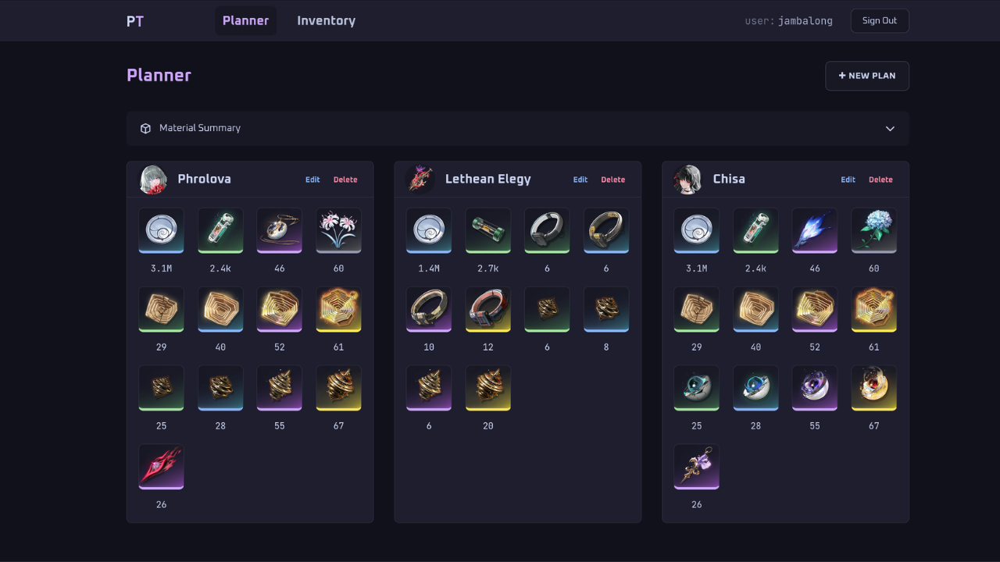
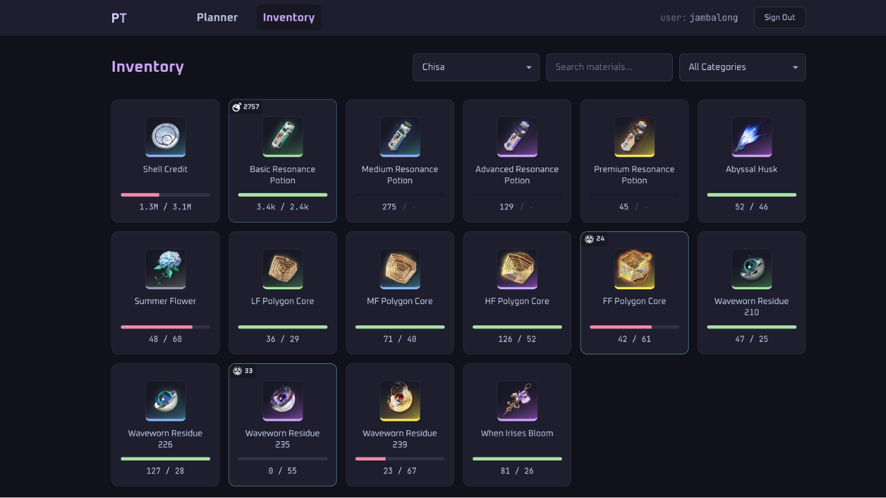
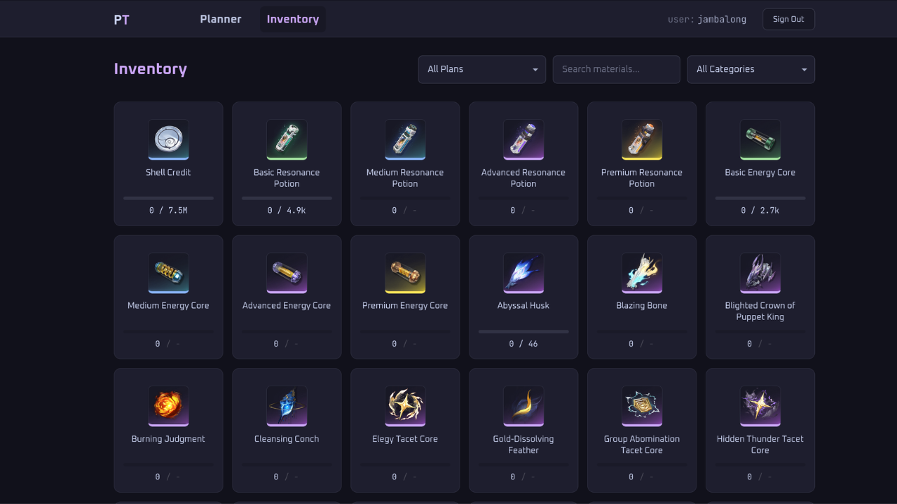
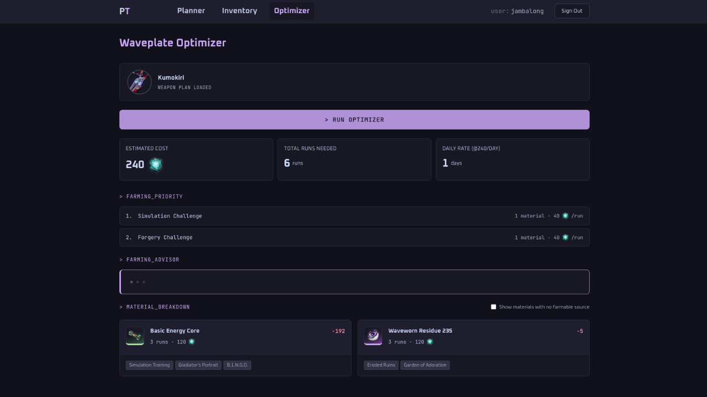
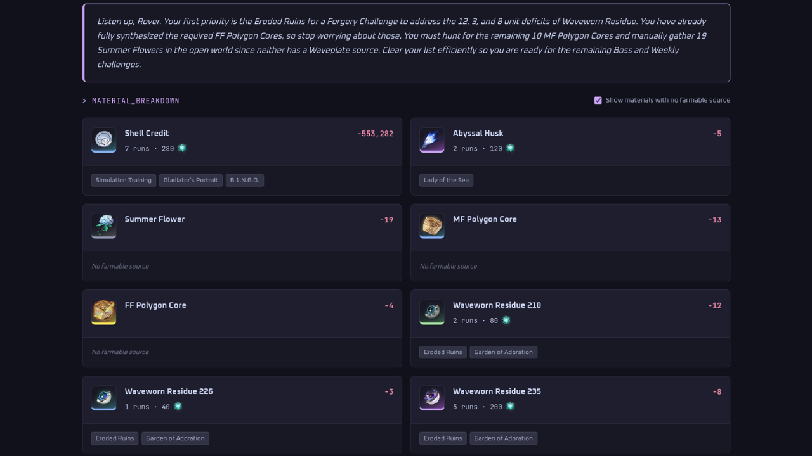

# Progression Planner and Farming Optimizer for Wuthering Waves

**Pangu Terminal** helps *Wuthering Waves* players plan and track the materials needed to max out their Resonators and weapons. Input your current levels and target upgrades, track what you own, and the app automatically shows you what to farm next accounting for synthesis chains so you don't waste time grinding materials you can craft.

[](https://github.com/jambalong/pangu-terminal/actions/workflows/ci.yml)
[](https://codecov.io/github/jambalong/pangu-terminal)

**Status:** MVP complete with planning, inventory tracking, synthesis detection, Waveplate optimizer, LLM farming advisor, and a REST API.

Live at [panguterminal.ambalong.dev](https://panguterminal.ambalong.dev)

Note: hosted on a free tier, the app may take up to a minute to wake up on first load if idle.

## Getting Started

### Prerequisites
- Ruby 3.4+ (via `rbenv`, `asdf`, `mise`, or system)
- Docker & Docker Compose
- Git

### Local Development

1. **Clone and navigate:**
   ```bash
   git clone https://github.com/jambalong/pangu-terminal.git
   cd pangu-terminal
   ```

2. **Install gems:**
   ```bash
   bundle install
   ```

3. **Set up environment variables:**
   ```bash
   cp .env.example .env
   ```

   Note: The Farming Advisor requires a Gemini API key configured in Rails credentials. To see it in action, visit the live app: `panguterminal.ambalong.dev` - Local setup runs without it nonetheless.

4. **Start the database container:**
   ```bash
   docker-compose up -d
   ```

5. **Prepare the database:**
   ```bash
   bin/rails db:prepare
   ```

   Note: If this fails with a password authentication error, the Docker volume may already exist from a previous run with different credentials. Run docker-compose down -v then docker-compose up -d and retry.

6. **Run the server:**
   ```bash
   bin/dev
   ```

   The app will be available at `http://localhost:3000`.

### Running Tests

```bash
bin/rails test        # unit + integration
bin/rails test:system # system tests
```

## What This Project Showcases

### Full-Stack Rails Architecture
- Service objects extracting complex business logic (planners, synthesis, drop rate, farming priority, LLM advisor)
- Polymorphic associations so character and weapon plans share identical CRUD operations
- JSONB caching for plan output: computed once, stored as a hash, read without joins
- Guest authentication via secure UUID tokens stored in cookies (no Devise required for trials)
- Turbo Streams for real-time inventory updates without full page reloads

### REST API
- Token-based authentication via Bearer header
- RESTful endpoints exposing core business logic as JSON
- Integration tests verifying authentication, authorization, and response contracts

### LLM Integration
- Context-aware farming advisor injecting live player data into a structured prompt
- Async Turbo Frame so the page renders immediately while the LLM call resolves in the background
- Graceful fallback when the API is unavailable
- Thin `LlmClient` wrapper keeping the service layer decoupled from the RubyLLM interface

### Production-Ready Deployment
- Dockerized deployment to Render, with PostgreSQL hosted on Neon
- PostgreSQL JSONB for flexible data modeling
- Docker-compose local development environment
- Automated database migrations and seeding on boot

## Feature Overview

### Ascension Planner
Players manually calculate material costs across multiple upgrade paths (levels, ascension ranks, skills, forte nodes).

Implemented a service-based planner that:
- Validates upgrade ranges against game mechanics (e.g., can't reach level 50 at ascension rank 0)
- Queries cost tables for the delta range (current --> target)
- Resolves material types to material IDs via mapping tables
- Returns a structured material requirement hash cached in JSONB

**Technical Highlights:**
```ruby
# Polymorphic plan design
Plan
  ├── belongs_to :subject, polymorphic: true (Resonator | Weapon)
  ├── plan_data (JSONB)
  │   ├── input: { current_level, target_level, ... }
  │   └── output: { material_id => quantity }
  └── guest_token # (for unauthenticated users)

# Service layer handles complexity
ResonatorAscensionPlanner.new(
  resonator: aemeath,
  current_level: 1,
  target_level: 90,
  # ... validates and calculates
).call
```



By separating game rules (stored in cost tables) from business logic (planner service), it makes the system maintainable and testable.

---

### Inventory Management & Synthesis
Players own materials across 5 rarity tiers. Lower tiers can be synthesized (3:1) into higher tiers, but players can't easily see if they have "enough" when accounting for conversions.

It features a Synthesis Service that:
- Reconciles owned inventory against plan requirements
- Detects EXP potion equivalence (e.g., 20 Basic potions = 2 Premium potions via exp_value)
- Identifies synthesis opportunity (e.g., "You have 18 surplus Cadence Seed -> can craft 6 Cadence Bud")
- Returns detailed satisfaction data with visual indicators

**Technical Highlights:**
```ruby
# Cross-tier equivalence detection
inventory = { premium_potion_id => 3 }  # 60k exp
requirements = { basic_potion_id => 40 }  # 40k exp needed

SynthesisService.new(inventory, requirements).reconcile
# => { basic_potion_id => { fulfilled: true, ... } }

# Synthesis opportunity in output
craftable_count: 2  # surplus / 3, nil if no surplus or not synthesizable
```



This solves the core "resource paradox" where players have data but can't act on it without manual spreadsheet recalculation.

---

### Plan Aggregation & Filtering
Users create multiple plans (Jinhsi + Jiyan + Yinlin), and need to see material requirements both aggregated (total across all plans) and filtered (single plan focus).

Two views are supported:

- **Planner Dashboard:** Shows total materials needed across all active plans
- **Inventory Page:** Filtered view (single plan) or aggregated view (all plans), with a plan dropdown selector

**Technical Highlights:**
```ruby
# Accumulate requirements across all plans
plans.each_with_object({}) do |plan, totals|
  plan.plan_data.dig("output").each do |material_id, qty|
    totals[material_id.to_i] = (totals[material_id.to_i] || 0) + qty
  end
end

# Plan filtering in controller
if @selected_plan.present?
  requirements_hash = (@selected_plan.plan_data.dig("output") || {}).transform_keys(&:to_i)
else
  requirements_hash = Plan.fetch_materials_summary(@plans)
end
```



---

### Waveplate Optimizer
Players need to know how many runs of a specific farming source it will take to cover their material deficits before they start spending Waveplates.

The Waveplate Optimizer:
- Runs reconciliation against the player's current inventory to find active deficits
- Estimates runs and Waveplate cost per deficit material, broken down by farming source
- Converts higher-rarity EXP drops to rarity-2 equivalents for run estimation
- Falls back to the highest available phase data when no drop rate row exists for the user's current SOL3 phase
- Ranks farming source types by how many deficit materials each covers (Farming Priority)
- Includes a toggle to show or hide materials with no farmable Waveplate source

**Technical Highlights:**
```ruby
# DropRateService handles both standard and EXP materials
DropRateService.call(material, deficit, sol3_phase)
# => {
#   "Moonlit Groves" => { estimated_runs: 3, waveplate_cost: 120, source_type: "forgery_challenge", waveplate_cost_per_run: 40 },
#   "Abyss of Sacrifice" => { estimated_runs: 3, waveplate_cost: 120, source_type: "forgery_challenge", waveplate_cost_per_run: 40 }
# }

# FarmingPriorityService deduplicates by source type per material
FarmingPriorityService.call(results)
# => [
#   { source_type: "forgery_challenge", source_label: "Forgery Challenge", material_count: 3, waveplate_cost: 40 },
#   { source_type: "simulation_challenge", source_label: "Simulation Challenge", material_count: 2, waveplate_cost: 40 }
# ]
```



Drop rate data is sourced from community spreadsheets and covers forgery, simulation, boss, and weekly challenge source types across all SOL3 phases.

---

### LLM Farming Advisor
Players have a farming priority ranking but still need to decide what to do with it, especially when synthesis can partially cover a deficit.

The Farming Advisor reads the player's actual optimizer data and gives a specific plain-English recommendation before they spend their Waveplates.

- Loads asynchronously via Turbo Frame, optimizer results are not blocked
- Injects live data into the prompt: deficits, estimated runs, synthesis chain coverage across all tiers, farming priority, and SOL3 phase
- Instructs the model to reason only over injected numbers, not game knowledge
- Handles `enemy_drop` materials correctly, no Waveplate source, must be hunted in the open world
- Falls back to a static message if the API is unavailable

**Technical Highlights:**
```ruby
# chain_coverage walks the full tier chain bottom-up
synthesis = SynthesisService.new(owned, needed)
reconciled = synthesis.reconcile
chain = synthesis.chain_coverage
# => { material_id => craftable_count_across_all_tiers }

# FarmingAdvisorService formats context and calls the LLM
FarmingAdvisorService.call(
  results: @results,
  farming_priority: @farming_priority,
  chain_coverage: @chain_coverage
)
```



## API

Pangu Terminal exposes a versioned, token-authenticated REST API (`/api/v1`) for plans, inventory, reconciliation, materials and Waveplate summaries. Bearer tokens are created per user (up to 3 keys) and rate limited to 60 requests/minute per key.

```bash
curl https://panguterminal.ambalong.dev/api/v1/plans -H "Authorization: Bearer <your_api_token>"
```

Endpoints: `GET/POST /plans`, `GET /plans/:id/reconciliation`, `GET /plans/:id/waveplate-summary`, `GET /inventory`, `GET /materials`, `PATCH /profile`. Full reference with request/response examples: **[docs/API.md](docs/API.md)**.

## Architecture & Design Decisions

Key decisions, each documented with code in **[docs/ARCHITECTURE.md](docs/ARCHITECTURE.md)**:

- **Service objects** for business logic (planners, synthesis, drop rates, farming priority, LLM advisor)
- **JSONB plan caching** and **polymorphic plans** (Resonator | Weapon)
- **Guest user system** with a migration path to registered accounts
- **Turbo Streams** for live inventory/synthesis updates
- **SHA-256 hashed API tokens**; **404 instead of 403** for non-owner resources; **Rack::Attack** per-key throttling
- **LLM context injection**, a thin `LlmClient` wrapper, and an **async Turbo Frame** so the advisor never blocks the page

More documentation: [docs/README.md](docs/README.md) (data model, game data, development, testing, deployment, roadmap). Contributor/agent guidance: [AGENTS.md](AGENTS.md).

## Technology Stack

| Component | Technology |
| --- | --- |
| Backend | Rails 8.1 + Ruby 3.4 |
| Database | PostgreSQL 17 (Neon) |
| Frontend | Hotwire (Turbo + Stimulus) |
| Deployment | Docker + Render |
| Testing | Minitest |

### Project Structure
```
app/
├── models/
│   ├── plan.rb              # Core polymorphic plan model
│   ├── inventory_item.rb    # User inventory tracking
│   ├── material.rb          # Game material definitions
│   ├── resonator.rb         # Character model
│   ├── weapon.rb            # Weapon model
│   └── user.rb              # User authentication (Devise)
├── controllers/
│   ├── api/
│   │   └── v1/
│   │       ├── base_controller.rb        # Auth + error handling
│   │       ├── inventory_controller.rb   # Inventory API endpoint
│   │       ├── materials_controller.rb   # Materials API endpoint
│   │       └── plans_controller.rb       # Plans API endpoint
│   ├── plans_controller.rb
│   ├── inventory_controller.rb
│   ├── optimizers_controller.rb
│   └── ...
├── services/
│   ├── resonator_ascension_planner.rb   # Resonator cost calculation
│   ├── weapon_ascension_planner.rb      # Weapon cost calculation
│   ├── synthesis_service.rb             # Inventory reconciliation
│   ├── drop_rate_service.rb             # Waveplate run estimation
│   ├── farming_priority_service.rb      # Farming source ranking
│   ├── farming_advisor_service.rb       # LLM farming recommendation
│   └── llm_client.rb                    # RubyLLM wrapper
├── views/
│   ├── layouts/
│   ├── plans/
│   ├── inventory/
│   ├── optimizer/
│   └── ...
└── helpers/

db/
├── migrate/          # Schema migrations
├── seeds.rb          # Seed game data (cost tables, materials)
└── schema.rb

test/
├── controllers/    # Web + API controller integration tests
├── models/
├── services/       # Planner, synthesis, drop rate, farming priority
├── forms/
├── helpers/
├── integration/
└── system/         # End-to-end user journey (Cuprite + Capybara)

docker-compose.yml
```

---

### Live Deployment Status

The production version of this application is deployed via **Docker** to **Render**, with **PostgreSQL** hosted on **Neon**.

* **Public URL:** `https://panguterminal.ambalong.dev`
* **Deployment Tooling:** Render builds and deploys directly from the `main` branch on push, using the repo's existing Dockerfile. Database schema and seed data are applied on container boot via `bin/docker-entrypoint`.
* **History:** The original capstone-graded deployment used Kamal 2 to a DigitalOcean droplet. That infrastructure was decommissioned after DigitalOcean student credits expired, and the app was migrated to Render + Neon to keep the live demo running at no cost. See [docs/DEPLOYMENT.md](docs/DEPLOYMENT.md) for the current runbook; the Kamal configuration was removed and remains in git history.

---

**Last Updated:** October 2026
**Version:** 1.2.0
